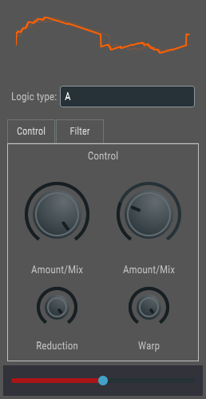

# HandyOsc Audio Plugin - Turn any audio into a digital synth

<p align="center">
  
</p>

This is a effect plugin that uses wave warping logic to create sawtooth-like waves from input audio. Combine warp and bit reduction to get new sounds!
* Supported hosts: VST3 only.

I haven't tested other plugin formats other than VST3. But JUCE supports VST, VST3, AU, AUv3, AAX and LV2 audio plug-ins, I might get lucky.

# Features:
1. 3 waveform warping algorithms
2. Bitcrush
3. Pre/Post filter
4. Oscilloscope

# Dependencies

Build on top of the JUCE framework and foleys_gui_magic GUI builder.

# Build

Examples:
* Windows + MSVC:
```console
mkdir build
cd build
cmake .. -G "Visual Studio 17 2022"
cmake --build . --target HandyOsc_VST3 --config Release
```

* Linux + GCC:
```console
mkdir build
cd build
cmake .. -G "Unix Makefiles"
cmake --build . --target HandyOsc_VST3 --config Release
```